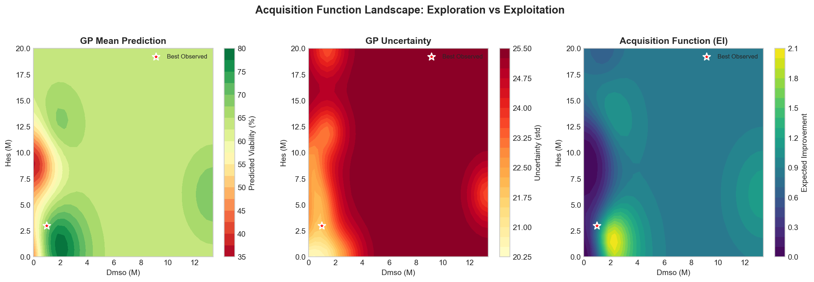
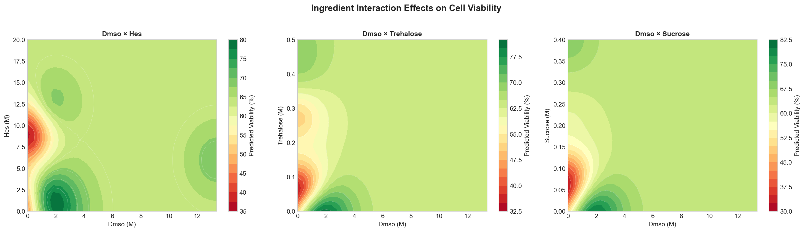

# CryoMN ML-Based Cryoprotective Solution Optimization

Machine learning pipeline for optimizing cryoprotective formulations for cryomicroneedle (CryoMN) technology.

## Goals

1. **Minimize DMSO usage** (reduce toxicity)
2. **Maximize cell viability** (maintain therapeutic efficacy)
3. **Limit ingredients** (≤10 components per formulation)

---

## Workflow Overview

The project was developed using a multi-agent AI workflow, combining planning and implementation phases with human oversight:


---

## Approach

**Gaussian Process Regression + Bayesian Optimization**
- Works well with limited data (~200 samples)
- Provides uncertainty quantification
- Supports iterative refinement with wet lab validation

## Quick Start

```bash
# Install dependencies
pip install -r requirements.txt

# 1. Parse formulation data
python src/01_data_parsing/parse_formulations.py

# 2. Train GP model
python src/02_model_training/train_gp_model.py

# 3. Generate candidates (choose one)
python src/03_optimization/optimize_formulation.py      # Fast random sampling
python src/05_bo_optimization/bo_optimizer.py          # Proper BO with DE

# 4. Integrate wet lab results (after experiments)
python src/04_validation_loop/update_model.py

# 5. Explain model predictions
python src/06_explainability/explainability.py
```

## Results

### Random Sampling (`03_optimization`)

| Category | Best Candidate | Predicted Viability |
|----------|----------------|---------------------|
| General (≤5% DMSO) | 1.83M EG + 52% FBS + 0.6% HES | 72.4% ± 23.6% |
| DMSO-free | 2.07M ethylene glycol | 81.6% ± 20.8% |

> **Key Finding**: The model predicts high ethylene glycol concentrations (~2M) are highly effective without DMSO.

### DE-based BO (`05_bo_optimization`)

| Category | Best Candidate | Expected Improvement |
|----------|----------------|----------------------|
| General (≤5% DMSO) | 10-ingredient formulation | EI = 0.842 |
| DMSO-free | 10-ingredient formulation | EI = 0.840 |

> **Note**: DE-based BO prioritizes *informative* experiments (high uncertainty) over highest predicted mean.

See `results/` for full candidate lists.

---

## Model Explainability

Understanding which ingredients drive cell viability predictions is crucial for guiding wet lab experiments. The explainability module generates comprehensive visualizations:

### SHAP Importance

SHAP values reveal how each ingredient impacts individual predictions. High DMSO concentrations (pink dots) can have both positive and negative effects:


### Acquisition Landscape

The Expected Improvement landscape guides the optimizer towards high-value regions:



### Interaction Contours

Visualizing how pairs of top ingredients interact to affect viability:



For detailed interpretation and additional visualizations, see [`src/06_explainability/README.md`](src/06_explainability/README.md).

---

## Project Structure

```
├── data/
│   ├── raw/                    # Original literature data
│   ├── processed/              # Parsed formulations (~198 rows)
│   └── validation/             # Wet lab results template
├── models/                     # Trained GP model + scaler
├── results/                    # Optimized candidate formulations
└── src/
    ├── 01_data_parsing/        # Parse CSV, normalize units, merge synonyms
    ├── 02_model_training/      # Train GP regression model (Matérn kernel)
    ├── 03_optimization/        # Random sampling + GP prediction (fast)
    ├── 04_validation_loop/     # Integrate wet lab feedback, retrain model
    ├── 05_bo_optimization/     # Proper BO with Differential Evolution
    └── 06_explainability/      # Generate SHAP and explainability plots
```

## Module Descriptions

| Module | Method | Best For |
|--------|--------|----------|
| `01_data_parsing` | Data Parsing & Normalization | Preparing clean, structured training data from raw literature |
| `02_model_training` | Gaussian Process Regression (Matérn Kernel) | Learning the viability landscape from limited data |
| `03_optimization` | Random sampling, ranks by highest predicted mean | Quick generation, when speed matters |
| `04_validation_loop` | Data merging & Model Retraining | Closing the active learning loop with wet lab feedback |
| `05_bo_optimization` | Differential Evolution, maximizes Expected Improvement | Most informative experiments, exploration-exploitation balance |
| `06_explainability` | SHAP, PDPs, Interaction Contours | Understanding model drivers and ensuring trust |

## Key Features

- **34 ingredients** tracked (DMSO, trehalose, glycerol, FBS, PEG by MW, etc.)
- **PEG molecular weight handling**: Individual tracking of PEG 400, 600, 1K, 3350, 5K, 10K, 20K, etc.
- **Dual unit handling**: Molar (`_M`) for CPAs, Percentage (`_pct`) for sera/polymers
- **Synonym merging** (e.g., FBS = FCS = fetal bovine serum)
- **Unit normalization** (concentrations converted to molar or kept as percentage)
- **Uncertainty quantification** (GP provides confidence intervals)
- **Iterative refinement** (model improves with each wet lab validation)
- **Explainable AI** (SHAP and partial dependence plots to interpret Black Box GP)
- **Two optimization modes**: Fast random sampling OR proper Bayesian optimization
